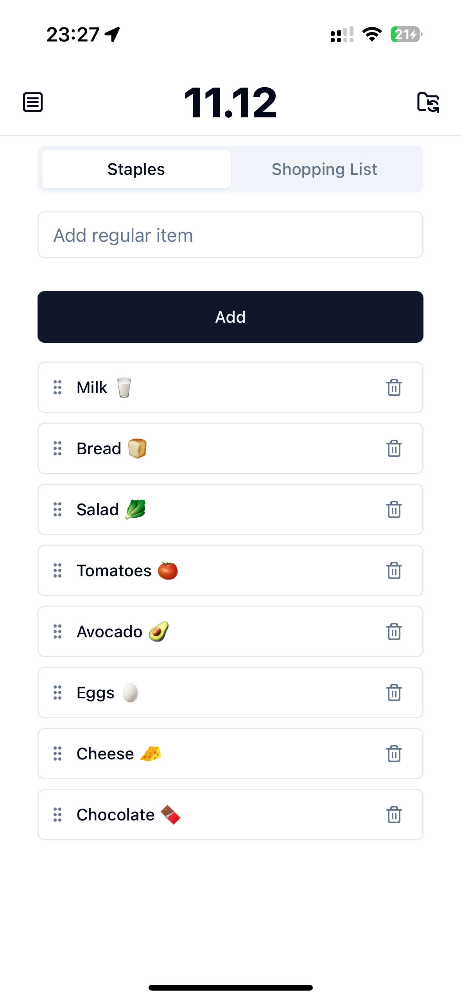

# Only Groceries

Minimalistic grocery list app with focus on frequently used everyday products.

> The app is in its pre-pre-alpha stage. You can try it at [`https://onlygroceries.pages.dev`](https://onlygroceries.pages.dev). Please, remember
that the demo version uses public automerge sync server and the data can be erased at any time.

## Goals

- Minimalistic app with clear functionality.
- Local-first. The app should be working even if there is no internet connectivity.
- TODO?

## Concept

### Main Page

The main page consists of two tabs: `Regular Items` and `Shopping List`.

The `Regular Items` keep the list of your everyday products e.g. bread, milk, anything. Here you can:

- Manage regular products list: add, remove or re-arrange products.
- Add products to the `Shopping List` by clicking on them.

The `Shopping List` contains the products you're going to buy next time.

This makes the following workflow:

1. You add your regular items to the list.
2. Before going to the shop, you click on the item you're going to buy.
3. Once you're in the shop, switch to `Shopping List` tab to see only the items you need. No distractions!

## Self Hosting
